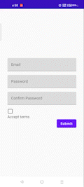

## **Compose-Projects**
- Repository for practicing Jetpack Compose
- Will be maintaining & adding new projects branch-wise in this repository

### **Projects covered so far**
- [Clean Architecture Notes App with Testing](https://github.com/YashKr01/Compose-Notes-App-with-Testing)
- [Clean Architecture Dictionar app with Caching](https://github.com/YashKr01/Compose-Playground/tree/dictionary)
- [Clean Architecture Form Validation](https://github.com/YashKr01/Compose-Projects/tree/form_validation)

### **Samples**
| Clean Architecture </br> Form Validation| Clean Arch Dictionary </br> with Caching | Clean Arch Notes |
------------|------------|------------|
|   |  | |

### **LICENSE**

```
Copyright (c) 2022 YASH KUMAR

Permission is hereby granted, free of charge, to any person obtaining a copyof this software and associated documentation files (the "Software"),
to dealin the Software without restriction, including without limitation the rightsto use, copy, modify, merge, publish, distribute, sublicense,
and/or sellcopies of the Software, and to permit persons to whom the Software is furnished to do so, subject to the following conditions:

The above copyright notice and this permission notice shall be included in all copies or substantial portions of the Software.

THE SOFTWARE IS PROVIDED "AS IS", WITHOUT WARRANTY OF ANY KIND, EXPRESS OR IMPLIED, INCLUDING BUT NOT LIMITED TO THE WARRANTIES OF MERCHANTABILITY,
FITNESS FOR A PARTICULAR PURPOSE AND NONINFRINGEMENT. IN NO EVENT SHALL THE AUTHORS OR COPYRIGHT HOLDERS BE LIABLE FOR ANY CLAIM, DAMAGES OR OTHER
LIABILITY, WHETHER IN AN ACTION OF CONTRACT, TORT OR OTHERWISE, ARISING FROM, OUT OF OR IN CONNECTION WITH THE SOFTWARE OR THE USE OR OTHER DEALINGS IN THE
SOFTWARE.
```
